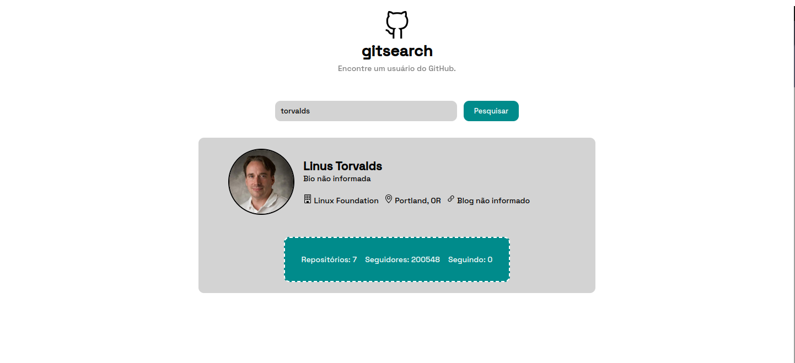

**GitSearch**
 
Enconte um usuário do GitHub

---
**🚀 Tecnologias:**
 
Esse projeto foi desenvolvido com **HTML**, **CSS**, **JavaScript** e utilizada a biblioteca **Axios** para consumir a _API do GitHub_.

**💻 Projeto:**
 
Campo para pesquisar pelo nome de usuário e trazer os dados do usuário pesquisado.

**🖱️ Visite:** _https://willpc5.github.io/git-search/_
